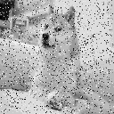

# Spread Specturm Image Steganography (SSIS)

This repository contains simple version of the SSIS algorithm. The algorithm does not normalize the added noise.

Secret message can be encoded to an image by first doing the error correction:

```
[encoded_image, image] = ECC(path_to_secret, secret_size);
```

and then the secret can be encoded to other image:

```
[encoded, params] = ssis_encode(path_to_cover, encoded_image, alpha, key, block_size);
```

Where alpha controls strength of signal, key is for a random generator and block size corresponds the size of discrete cosine transformation matrix.

Then the encoding can be done with a corresponding encoding function.

```
[decoded, params] = ssis_decode(path_to_ecoded, length_of_secret_bits, key, alpha, block_size);
```

# Example

If I want to encode a photo 


To a following image


Then following the encoding procedure with alpha=1 gives encoded version of the original cover image.


and the secret can be now calculated by following the decoding procedure. This gives:



Quality of the recovered image can be traded to more visible artefacts in the encoded cover image by tuning alpha.